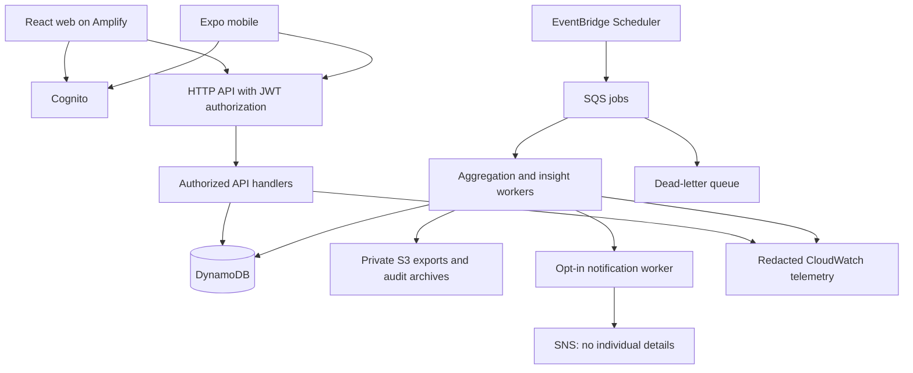

# Workload Balance Monitor

**Track:** Workforce, Productivity & Digital Life

**Status:** Monorepo scaffold initialized; product features not implemented

A privacy-first tool that combines synthetic task loads, working-pattern signals, and voluntary self-reports to describe potentially unsustainable workload trends. It makes no clinical judgments and never ranks employees.

## Product principles

- **Consent first:** application data processing and sharing require explicit, granular opt-in. Sharing is off by default and revocable.
- **No rankings or diagnoses:** describe patterns, not people. Synthetic data demonstrates functionality, not predictive validity.
- **Humans decide:** automated observations and manager decisions have separate interfaces, records, and permissions.
- **Transparency:** every insight explains its evidence, coverage, limitations, and confidence in the available evidence.
- **Correction:** users can dispute and correct observations, with dependent suggestions updated accordingly.

## Core deliverables

1. Personal workload trends, voluntary check-ins, preferences, and a preview of what managers can see.
2. Team capacity trends with contributor thresholds and disclosure safeguards.
3. Explainable suggestions for reprioritization, recovery time, or human review.
4. Separate manager actions with a human author, timestamp, and rationale.

Optional notes remain private and are excluded from team aggregates, notifications, and application logs. The initial release uses synthetic workloads and non-clinical indicators only; it does not collect keystrokes or passive device activity.

## Architecture assessment

The original proposal scores **6.5/10 overall**. These are design judgments, not results of a security audit or performance benchmark.

| Area | Rating | Assessment |
| --- | --- | --- |
| Security and privacy | 6/10 | Strong principles; authorization, revocation, and aggregate disclosure controls need concrete enforcement. |
| Smoothness and usability | 7/10 | Good dashboard concept; synchronization, mobile experience, and correction workflows need definition. |
| Scalability and reliability | 7/10 | Lambda and DynamoDB fit the workload; queries, capacity, retries, and recovery need deliberate design. |

### Required security improvements

**Use API Gateway HTTP API with Cognito JWT authorization.** Function URLs support `AWS_IAM` and `NONE`, not native Cognito user-pool JWT validation. Custom token validation is possible but adds maintenance and risk. Configure issuer, audience, and required access-token scopes in API Gateway. Every backend handler must also validate input, organization membership, team access, resource permissions, and current consent. A manager role must never imply access to every team. See [Function URL authentication](https://docs.aws.amazon.com/lambda/latest/dg/urls-auth.html) and [HTTP API JWT authorization](https://docs.aws.amazon.com/apigateway/latest/developerguide/http-api-jwt-authorizer.html).

**Keep authoritative consent in DynamoDB.** Cognito establishes identity; versioned consent records control personal processing, team contribution, and notifications. Check consent during ingestion, aggregation, and disclosure. A previously issued token must not preserve revoked sharing permissions. Invalidate affected snapshots on revocation and refuse to serve them until their eligibility is safely resolved. Define deletion, retention, and previously exported report limitations explicitly before release.

**Treat minimum group size as suppression, not guaranteed anonymity.** Count distinct consenting contributors per metric and reporting window, not total team headcount. A proposed initial threshold is five, subject to privacy review. Restrict filters, use fixed windows, suppress complementary small groups, and assess disclosure through overlapping or successive releases. Apply the same rules to APIs, charts, suggestions, and exports. Minimum group suppression alone is not formal k-anonymity; see [NIST de-identification guidance](https://csrc.nist.gov/pubs/sp/800/188/final).

**Separate observations and human decisions structurally.** Observations contain evidence, coverage, rule version, and correction status. Manager actions contain author, timestamp, and rationale. Use deterministic suggestion rules initially. Confidence describes evidence quality, never a probability of burnout. Manager notifications require explicit opt-in, contain no individual details, and link to an authorized team view.

**Apply least privilege and data minimization.** Use separate execution roles, private encrypted S3 storage, short-lived export access, redacted logs, explicit retention, and tested backup restoration. Manager endpoints cannot return raw employee records or participation lists.

### Smoothness requirements

- Personal dashboards remain usable with upward sharing disabled.
- Show a persistent “What your manager can see” preview.
- Distinguish insufficient data, privacy suppression, stale results, and synchronization errors.
- Check-ins show explicit pending, saved, and failed states.
- Corrections mark disputed evidence and refresh dependent suggestions.
- Clear sensitive caches on logout and consent changes; recheck consent before retrying submissions.
- Use accessible charts, timezone-aware windows, and configurable working schedules.
- Begin with online submission and explicit retries; defer persistent offline self-report storage until its privacy and conflict policies are defined.

### Scalability and reliability requirements

- Design DynamoDB queries before indexes; avoid full-table scans for recurring aggregation.
- Precompute team snapshots and paginate personal history.
- Use private workers, bounded retries, idempotency keys, and dead-letter queues.
- Use [EventBridge Scheduler](https://docs.aws.amazon.com/eventbridge/latest/userguide/using-eventbridge-scheduler.html), which AWS recommends over legacy scheduled rules.
- Provisioned capacity suits a predictable pilot, but fixed 5 RCU/5 WCU is not a growth strategy. Monitor throttling and account for indexes and transactions; evaluate autoscaling or on-demand as traffic changes.
- Show snapshot freshness and suppress invalidated results rather than silently serving them.

## Recommended technology stack

| Layer | Choice |
| --- | --- |
| Monorepo | pnpm workspaces + Turborepo |
| Language | TypeScript across clients, backend, and infrastructure |
| Web | React + Vite on AWS Amplify Hosting |
| Mobile | React Native + Expo for Android and iOS |
| Shared contracts | TypeScript and runtime validation with Zod |
| Client data | TanStack Query; platform-specific persistence policies |
| Authentication | Amazon Cognito; Authorization Code + PKCE for public clients |
| API | API Gateway HTTP API with JWT authorization |
| Compute | TypeScript AWS Lambda handlers and private workers |
| Database | DynamoDB, with a provisioned pilot configuration |
| Background jobs | EventBridge Scheduler + SQS + dead-letter queue |
| Notifications | SNS, explicitly opted in and free of individual details |
| Storage | Private S3 exports and consent audit archives |
| Observability | CloudWatch logs, metrics, and alarms without sensitive payloads |
| Infrastructure | AWS CDK in TypeScript |
| Tests | Unit/integration tests, Playwright for web, Maestro for mobile |
| CI/CD | GitHub Actions with independent web, mobile, and infrastructure releases |

Pin a supported Node.js LTS release; Node.js 24 is the proposed baseline, subject to selected Expo tooling compatibility. The previous `Node.js 18+` prerequisite is obsolete. See [Node.js releases](https://nodejs.org/en/about/previous-releases) and [Lambda runtimes](https://docs.aws.amazon.com/lambda/latest/dg/lambda-runtimes.html).

## Architecture



Clients read authorized snapshots; they do not invoke unrestricted aggregation jobs. All disclosure paths apply the same privacy policy. Consent changes and corrections invalidate affected derived results.

## Single monorepo for web, mobile, and backend

The following structure is initialized with starter apps, package boundaries, and development configuration. Product features remain to be implemented:

```text
workload-balance-monitor/
├── apps/
│   ├── web/                    # Employee and manager web interfaces
│   └── mobile/                 # Expo Android/iOS application
├── services/
│   ├── api/                    # Consent, check-ins, corrections, views, actions
│   └── workers/                # Aggregation, insights, notifications, exports, deletion
├── packages/
│   ├── contracts/              # Request/response schemas and shared types
│   ├── domain/                 # Workload rules and evidence calculations
│   ├── api-client/             # Typed client for web and mobile
│   ├── design-tokens/          # Colors, spacing, typography
│   ├── ui-web/                 # Accessible browser components
│   ├── ui-native/              # Native mobile components
│   ├── backend-core/           # Server-only authorization and data access
│   ├── test-fixtures/          # Synthetic datasets
│   └── tooling/                # Shared lint and TypeScript configuration
├── infra/                      # CDK resources, permissions, alarms
├── tests/
│   ├── integration/
│   ├── privacy/                # Consent, suppression, tenant isolation
│   └── e2e/
├── docs/                       # Architecture, threat model, data policy
├── .github/workflows/
├── pnpm-workspace.yaml
├── turbo.json
└── package.json
```

Share contracts, business logic, clients, and design tokens. Keep browser and native components separate where interaction needs differ. Enforce import boundaries so client packages cannot include backend-only code or credentials. Keep applications independently deployable and native dependencies compatible.

[Expo supports workspace monorepos](https://docs.expo.dev/guides/monorepos/). Follow the hosting-specific install and app-root settings in [Amplify's monorepo documentation](https://docs.aws.amazon.com/amplify/latest/userguide/monorepo-configuration.html).

CI should test changed packages and their dependants, use short-lived AWS credentials through GitHub OIDC, and isolate development, staging, and production. Infrastructure changes should have reviewable deployment plans. No deployment credentials belong in the repository.

## Proposed DynamoDB records

Keys below illustrate the intended entities; final indexes depend on verified access patterns. Key prefixes do not replace authorization checks.

| Entity | PK | SK | Purpose |
| --- | --- | --- | --- |
| Task load | `ORG#<org>#USER#<id>` | `TASK#<timestamp>#<recordId>` | Multiple synthetic records without date collisions |
| Self-report | `ORG#<org>#USER#<id>` | `REPORT#<timestamp>#<recordId>` | Voluntary 1–5 manageability rating and private optional note |
| Current consent | `ORG#<org>#USER#<id>` | `CONSENT` | Versioned scopes and effective time |
| Consent event | `ORG#<org>#USER#<id>` | `CONSENT_EVENT#<timestamp>#<id>` | Minimal audit trail |
| Team membership | `ORG#<org>#TEAM#<id>` | `MEMBER#<userId>` | Authorized membership and effective dates |
| Team snapshot | `ORG#<org>#TEAM#<id>` | `TREND#<week>#<version>` | Window, policy version, validity, aggregate results |
| Observation | User or team partition | `OBSERVATION#<timestamp>#<id>` | Evidence, rule version, confidence, correction status |
| Correction | User partition | `CORRECTION#<timestamp>#<id>` | Dispute and corrected evidence reference |
| Manager action | Team partition | `ACTION#<timestamp>#<id>` | Human-authored decision, separate permissions |

Use conditional writes or transactions for version conflicts and consent-sensitive writes. Store idempotency records for submissions and background jobs. Design membership indexes to support bounded team processing. Internal contributor metadata must not leak through manager responses.

## Cost assumptions

**Designed for low operating costs; actual charges depend on account eligibility, configuration, and usage.** Do not describe this stack as permanently free.

- AWS changed its new-account Free Tier on July 15, 2025. The Free plan lasts up to six months or until credits run out; legacy account terms differ. See [AWS Free Tier FAQ](https://aws.amazon.com/free/free-tier-faqs/).
- DynamoDB advertises 25 RCU/25 WCU provisioned allowances and storage allowances, but backups and additional features may incur charges. See [DynamoDB pricing](https://aws.amazon.com/dynamodb/pricing/).
- Cognito's 10,000-MAU allowance applies to qualifying direct/social sign-ins on Lite or Essentials. Plus and enterprise federation differ. See [Cognito pricing](https://aws.amazon.com/cognito/pricing/).
- Function URLs eliminate an API Gateway charge, not the cost of compute, hosting, storage, or operations. The recommended HTTP API is a deliberate security and maintenance tradeoff.
- Include Amplify builds/hosting, logs, transfer, queues, notifications, backups, exports, and mobile distribution in estimates. See [Amplify pricing](https://aws.amazon.com/amplify/pricing/).
- Configure budget alerts and operational limits; alerts are not a hard spending cap. Verify pricing and account eligibility before deployment.

## Implementation order and release gates

1. Scaffold the monorepo and infrastructure with isolated environments.
2. Implement authentication, tenant/team authorization, consent, and audit events.
3. Build personal views, check-ins, and correction workflows.
4. Add aggregation with privacy tests and snapshot invalidation.
5. Add deterministic explanations, separate manager actions, and opt-in notifications.
6. Validate web/mobile journeys, recovery, access boundaries, and realistic load before release.

Required checks include cross-tenant access denial, manager scope enforcement, consent-revocation races, contributor-threshold boundaries, complementary suppression, correction propagation, duplicate submissions/jobs, and backup recovery. Synthetic fixtures should cover missing data, small cohorts, membership changes, and disputed observations.

## Repository status and setup

The repository includes React/Vite and Expo starter screens, shared TypeScript packages, fail-closed backend entry points, an empty CDK stack, and a validation CI workflow. It does not implement authentication, workload processing, aggregation, or cloud deployment.

Use Node.js 24 LTS (Node 22.13+ is also supported) and pnpm 10.30.0:

```bash
corepack enable
corepack prepare pnpm@10.30.0 --activate
pnpm install --frozen-lockfile
pnpm dev:web
# In another terminal:
pnpm dev:mobile
```

Run `pnpm check` for lint, type-checks, consent contract tests, and web/backend builds. Run `pnpm mobile:check` for Expo dependency compatibility and `pnpm infra:synth` for local empty-stack synthesis. Native device testing and deployment are separate steps. On restricted Windows PowerShell, use `pnpm.cmd` instead of `pnpm`.

See [local development](docs/development.md) for command details and [engineering documentation](docs/README.md) for architecture boundaries, initial threats, and data-policy decisions.

## Future enhancements

- Configurable contributor thresholds above an enforced privacy floor.
- Manager audit trail connecting suggestions to human actions.
- Carefully reviewed organization-level aggregate reporting.
- Voluntary Slack/Teams check-ins.
- Offline mobile support after retention and synchronization policy design.

## License

TBD. No open-source license has been selected.
