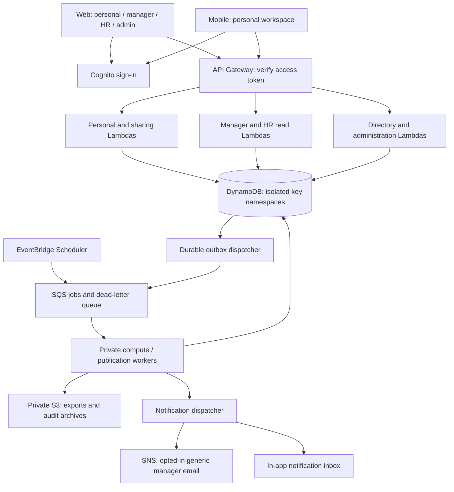

# Workload Balance Monitor

**Track:** Workforce, Productivity & Digital Life

**Status:** Phases 0 through 6 are fully implemented and verified. All automated release gates, personal journeys, explicit manager sharing, protected aggregations, administration, notifications, and owner export/deletion lifecycle workflows pass end-to-end verification. No real employee data should be loaded yet.

A private workspace for people to understand their workload and decide what to share. Everyone, including managers and HR staff, has a personal dashboard. Direct managers can view only items deliberately shared with them and eligible team aggregates. HR sees eligible organization aggregates only. Personal records remain until their owner deletes them, except explicitly dated one-time private items, which expire after one year.

[Product](#1-product-and-data) · [Roles](#2-accounts-roles-and-access) · [Pages](#3-pages-and-navigation) · [Sharing](#4-sharing-and-privacy-rules) · [Flows](#5-end-to-end-flows) · [AWS](#6-architecture-and-aws-responsibilities) · [Database](#7-dynamodb-schema) · [API](#8-api-contract) · [Repository](#9-monorepo-and-local-development)

## 1. Product and data

Operational defaults labeled **proposed** must be finalized before live deployment.

### Delivery progress

- [x] **Phase 0 — contracts, domain rules, and synthetic fixtures.** Runtime schemas cover separate consent scopes, tasks, check-ins, private items, directory records, expiring direct-manager grants, frozen publications, evidence-strength responses, and suppression states. Pure functions calculate weekly personal trends, explainable observations, one-time-item retention, minimum-five aggregation, and successive-release overlap suppression. Seeded fixtures are synthetic and deterministic.
- [x] **Phase 1 — development cloud and backend foundation.** Cognito identity, DynamoDB persistence primitives, current-membership authorization, direct-manager/reporting-line checks, namespace-scoped IAM, HTTP API JWT authorization, identifier-only outbox dispatch, SQS/DLQ, private export storage, logs, and a disabled weekly schedule are deployed in the development stack.
- [x] **Phase 2 — personal web/mobile journeys.** Built onboarding, consent, task/check-in/private-item CRUD, personal dashboards, corrections, and client authentication.
- [x] **Phase 3 — explicit manager sharing.** Built exact preview, frozen selected-field publication, expiry/revocation, access history, and the web manager inbox.
- [x] **Phase 4 — protected team/HR releases.** Built privacy-gated workers, aggregate calculation pipelines, minimum-five suppression, successive release overlap protection, and web aggregate dashboards.
- [x] **Phase 5 — administration, actions, and notifications.** Built directory management, team reporting lines, policy administration with enforced $\ge 5$ floor, separate human decision records for manager and HR without copying private text, in-app notifications, opted-in preferences, and administrative isolation test suite.
- [x] **Phase 6 — owner export/deletion and recovery.** Built owner data export and download with 24-hour expiration, permanent cascading account deletion and grant revocation, background lifecycle worker for one-time item retention pruning, and comprehensive 14-point Section 10 Release Gates audit suite.


The product helps answer three questions: **How is my workload changing? What do I want my manager to know? Is the consenting team's or organization's workload becoming harder to sustain?**

### First-release scope

- Real dashboards use records entered by the user. No made-up values fill gaps.
- A separate, clearly labeled synthetic demo lets judges explore sample experiences. Demo identities and records never mix with live organizations, publications, or notifications.
- Web supports personal, manager, HR, and organization-administration workspaces.
- Mobile supports personal dashboards, workload entry, check-ins, private items, sharing controls, and notifications. Managers and HR staff use the same personal mobile experience; their work dashboards are on the website.
- No keystrokes, screenshots, mouse activity, passive app tracking, employee rankings, clinical diagnoses, or automated discipline.
- Insights use explainable workload rules. An evidence label describes data coverage and consistency, not a probability of burnout.
- All processing and sharing choices are explicit. An account can exist with all optional processing/sharing disabled.

### Data the user supplies

| Data | Fields and use | Default visibility |
| --- | --- | --- |
| Account profile | Display name, email, timezone; credentials handled by Cognito | Self; minimum directory fields available for organization administration |
| Workload preferences | Optional weekly capacity, workdays, preferred check-in schedule | Self |
| Task/workload record | Title, date, estimated effort, optional deadline and priority, status; effort units remain consistent | Self; selected fields may be shared with the direct manager |
| Voluntary check-in | Date, manageability rating from 1 (very difficult) to 5 (very manageable), optional private note | Self; date and rating may be shared with the direct manager |
| Private items | Notes, personal goals, leave reasons/details, important personal deadlines, private reminders and personal commitments; see retention rules | Owner only; excluded from upward sharing and aggregates; opted-in owner reminders use generic text |
| Sharing choices | Named direct manager, selected records/fields or summary, covered dates, expiry | Owner and recipient see the grant relevant to them |
| Consent and corrections | Processing choices, aggregate audience choices, disputed observations and corrections | Owner; services use only the metadata required to enforce policy |

Private free text never enters team or organization aggregates. A task title may appear in a direct-manager share only when the user selects that field. Private notes and private items have no upward-sharing path.

### What the system derives

Personal trends show weekly effort estimates and voluntary manageability patterns. Comparisons with capacity appear only if the user supplies a capacity estimate. Missing input produces an insufficient-data state, not a zero or a negative judgment. Task counts or estimates are not productivity scores.

Every observation includes its reporting window, underlying evidence, generation time, rule version, evidence-strength label, and correction status. Suggestions may invite reprioritization, recovery planning, or an optional conversation with the direct manager. Nothing is sent to the manager just because an observation was generated.

For aggregates, compute per-person values first and give each eligible contributor equal weight. Show only approved fixed-window statistics. Label them as describing **consenting contributors**, not the entire workforce.

## 2. Accounts, roles, and access

One account has a permanent personal workspace plus zero or more organization-scoped work roles. A dashboard switch changes the workspace, not the person's identity or ownership rights.

| Context | Who has it? | May see | May do |
| --- | --- | --- | --- |
| Personal | Every active user, including manager, HR, and admin | Own records, private items, observations, grants, and access history | Enter/correct/delete own data; choose processing, sharing, export, and notification preferences |
| Manager | An active manager assigned to specific teams/direct reports | Eligible aggregates for assigned teams; active publications explicitly addressed to them by current direct reports | Read authorized shares; record separate human decisions and follow-up |
| HR | An active HR member scoped to an organization | Eligible organization-wide aggregates and organization-level human actions | Review organization capacity and record organization-level follow-up |
| Organization administrator | A separate organization administrative role | Membership directory, team assignments, role assignments, policy settings, administrative audit events | Invite/deactivate organization memberships, assign roles and reporting lines, administer disclosed policies |
| Background service | A narrowly scoped AWS execution role | Only the inputs required for its specific job | Calculate, publish approved views, invalidate, delete, or notify as authorized |

**HR cannot access individual shares, private items, individual check-ins, participation lists, or person-level drill-down.** Being HR does not automatically make someone a manager or administrator. If one person is explicitly assigned multiple roles, each workspace still uses its own restrictions.

An administrator cannot open personal content, grant consent on someone's behalf, impersonate a user, or inherit historical shares by changing reporting lines. Role changes are audited. Deactivating an organization membership does not disable the person's global personal account.

The first organization administrator is established through controlled provisioning. Users cannot select privileged roles during sign-up; subsequent assignments require an authorized administrator.

Any user, including a manager, may share with their own direct manager under the same rules. HR status alone never authorizes receiving an individual publication.

A manager's own private records remain available in **My workspace**. The manager dashboard never combines those records with team-member records. Manager status does not automatically exclude or include a person's contribution in aggregates; contribution consent and disclosure safeguards apply to them too.

### Authentication and authorization

1. Cognito handles sign-in, account verification, password recovery, and authentication sessions. Public web/mobile clients use Authorization Code with PKCE and no embedded client secret.
2. API Gateway validates the access token, issuer, audience/client, expiry, and required route scope. Authentication proves who is calling; it does not prove permission to a particular record.
3. The backend looks up ownership and, for work-context access or new organizational activity, current organization membership, applicable role and team assignment; it also checks consent/grant state and expiry. Owners may still review/export/delete their archived personal records after organization offboarding. Stale token role claims cannot preserve removed access.
4. Personal routes derive the owner from the verified token subject. Request bodies cannot select another owner. Individual-share manager routes require a current reporting relationship plus an active grant; team aggregate routes require assigned-team scope and an eligible release. HR routes expose only approved organization releases.
5. A denied request returns no protected content, even if the caller knows the URL or record ID. Hiding buttons in the browser is never the access-control mechanism.

Cognito groups may reflect broad roles, but DynamoDB membership and assignment records establish organization/team scope. AWS IAM controls service access to storage; product users receive no direct DynamoDB credentials. See [JWT authorization](https://docs.aws.amazon.com/apigateway/latest/developerguide/http-api-jwt-authorizer.html) and [Cognito groups](https://docs.aws.amazon.com/cognito/latest/developerguide/cognito-user-pools-user-groups.html).

## 3. Pages and navigation

**Default after sign-in: My workspace.** A web workspace switch offers Manager, HR, or Administration only when the account has that role. Switching organization or workspace clears incompatible cached data. Workspaces do not merge their feeds; manager review-email links open the authorized website, not a hidden mobile work dashboard. Mobile offers the personal workspace only.

All data pages need loading, empty, saved/pending, error/retry, and access-denied states as applicable. Trend pages additionally distinguish insufficient evidence, privacy suppression, stale output, and corrected evidence. Charts must have readable text alternatives and timezone-aware dates.

### Entry and personal pages

| Page / web route | Must contain | Mobile |
| --- | --- | --- |
| Welcome `/` | Product purpose, privacy boundaries, sign-in, and clearly separate demo entry | Welcome screen |
| Sign-in and callback `/sign-in`, `/auth/callback` | Cognito sign-in, recovery links, verification/session errors | System-browser authentication and app callback |
| Join and onboarding `/join`, `/onboarding` | Accept an invitation, verify membership, explain personal/work contexts, timezone and optional preferences; consent switches initially off | Same onboarding |
| Personal dashboard `/app` | User's workload summary, recent check-ins, personal observations, next-entry shortcuts, freshness and sharing status | Home |
| Tasks `/app/tasks`, `/app/tasks/:id` | List/create/edit/delete own workload records; date, effort, status, optional priority/deadline; explicit sharing entry | Tasks |
| Check-ins `/app/check-ins` | Voluntary 1–5 rating, private note, history, edit/delete, saved/pending indication | Check-ins |
| Private items `/app/private`, `/app/private/:id` | Owner-only items, private label, create/edit/delete; no recipient or sharing button | Private items |
| Personal trends `/app/trends` | Weekly workload/manageability charts, optional capacity comparison, evidence coverage and missing-data explanations | Trends |
| Observation detail `/app/observations/:id` | Evidence, date window, rule explanation, strength label, suggestion, flag/correct/dismiss; sharing only after a separate preview | Observation detail |
| Sharing center `/app/sharing` | Active/expired/revoked grants, recipient, fields, dates, expiry, last-view history; revoke action | Sharing |
| Share composer/detail `/app/sharing/new`, `/app/sharing/:id` | Select allowed existing records/summary and fields; show current direct manager; set date range and expiry; exact recipient preview; confirm | Share composer/detail |
| Privacy and data `/app/privacy` | Separate processing/team/HR aggregate controls; own export and deletion; retention notice; what the manager and HR can see | Privacy |
| Notifications `/app/notifications` | Personal reminders, share expiry/access updates, correction/export status and preferences; safe links to accessible pages | Notifications |
| Settings `/app/settings` | Profile, work preferences, timezone, security/session controls, organization switch and sign-out | Settings |

### Web-only work pages

| Page / route | Must contain | Access boundary |
| --- | --- | --- |
| Manager overview `/manager` | Assigned-team selector, eligible team trends, aggregate freshness, team suggestions | No employee ranking or hidden personal feed |
| Team detail `/manager/teams/:teamId` | Fixed reporting windows, safe aggregate statistics, evidence labels and suppression explanations | Assigned team + team-contribution opt-in + release policy |
| Shared with me `/manager/shared`, `/manager/shared/:grantId` | User-approved publications, selected fields, owner identity, covered dates and expiry | Current direct manager and named recipient; no other source records |
| Manager actions `/manager/actions`, `/manager/actions/:id` | Human author, date, rationale, status, follow-up date, optional reference to an authorized observation/share | Separate from automated output; do not automatically copy shared values into enduring action notes; authors must avoid personal details |
| HR overview `/hr` | Organization-level approved aggregates, trends, evidence coverage, privacy/freshness states | Organization aggregate consent; no employee search or team/person drill-down |
| HR actions `/hr/actions` | Human organization-level decisions, author, rationale, status and follow-up | Organization scope; no employee case records |
| People and invitations `/admin/people` | Invite/deactivate members; assign roles; see minimal directory information | Administrative metadata only |
| Teams and reporting lines `/admin/teams` | Create/update teams, memberships, direct-manager assignments and effective dates | Never exposes workload or consent participation |
| Policy settings `/admin/policies` | Privacy threshold above an enforced floor, operational retention and policy notices; the owner's indefinite personal retention cannot be overridden | Cannot enable user consent or lower protection below the floor |
| Administrative audit `/admin/audit` | Role, membership, invitation and policy changes | No private notes, personal insights, or employee workload-access details |

Leave reasons and important personal deadlines stay on private-item pages; they never appear in work dashboards or automatic summaries. Shareable task deadlines are separate fields on explicitly selected work records.

The owner preview uses the **same server-produced projection** as the recipient view. HR preview explains which aggregate categories the user contributes to; it does not reveal other contributors or promise that the user is individually identifiable to HR.

The manager inbox is ordered by sharing time, never by a workload/risk score. Human actions reference approved evidence without embedding a permanent copy; the reference becomes unavailable when its grant closes.

## 4. Sharing and privacy rules

### Separate choices, all initially off

| Choice | Meaning |
| --- | --- |
| Personal storage/processing | Allow the app to save user-entered workload/check-in/private data for the user's use; explain which records feed personal observations |
| Team aggregation | Allow eligible numeric inputs to contribute to manager-facing team releases |
| Organization aggregation | Allow eligible numeric inputs to contribute to HR-facing organization releases |
| Direct-manager grant | Share a specific set of existing records/fields or a frozen summary with the current named direct manager |
| Notifications | Choose each available delivery channel and audience separately |

Private items are excluded from workload computations. A private-item save does not enqueue insight or aggregation work. Team consent does not imply HR consent, and an individual share does not imply either aggregate consent. Essential account/security processing is described separately from these optional product choices.

### Individual sharing lifecycle

`Draft preview → explicit confirmation → active → expired / revoked / invalidated`

- Each grant contains one recipient, an exact record/version and field selection, an inclusive reporting range, creation time, and expiry. For summaries, freeze the contributing record/version set and the displayed values at confirmation. The date range alone does not authorize subsequently created records.
- The server copies only selected fields into a publication. Recipient handlers read that publication; they cannot query the owner's private record collection.
- New data, new fields, updated records, and a new manager are never automatically included. Editing/deleting shared source material invalidates the old publication; the user must preview and confirm a replacement.
- Recipient changes require a new grant. Removing the manager role, changing the direct-manager relationship, or leaving the organization blocks the old grant immediately on subsequent authorized reads.
- Expiry and revocation are enforced at read time. Database cleanup is asynchronous and is not the access-control mechanism.
- First-release manager access is view-only inside the authenticated website. There is no recipient download/export endpoint or public share link. Users may export their own data; HR aggregate export is deferred.
- A view already delivered or a screenshot cannot be recalled. The interface must explain this before confirmation, without claiming absolute revocability.

### Aggregate disclosure

Use an initial privacy floor of **five distinct consenting contributors per metric, audience and reporting window**. This is a proposed engineering baseline, not a guarantee of anonymity. A team of twelve with only three eligible contributors produces no released metrics. Administrators may raise the threshold, never lower it below the enforced floor. The same minimum and disclosure review apply to HR organization releases.

Use fixed weekly windows and a restricted metric set. Counts may be bucketed where needed; never reveal who participated, who opted out, private free text, or suppressed subgroup values. A manager viewing their own team's aggregate may already know their own inputs; privacy checks must account for this and other known/overlapping information rather than blindly relying on a headcount.

Review differences between successive releases and complementary groups before publication. A consent withdrawal must not produce a before/after pair that exposes one person's contribution. Suppress or delay an unsafe replacement. HR organization values must be independently derived from HR-consenting contributors, not obtained by adding manager team totals.

A release carries a policy version and disclosure generation. Revocation, relevant correction/deletion, or membership changes invalidate affected releases synchronously before any background recomputation. Reads fail closed while a release is invalid or privacy checks fail.

### Retention and deletion

| Record class | Retention |
| --- | --- |
| Personal notes, ongoing goals, ordinary task/check-in history and personal preferences | Retain until the owner explicitly deletes the item or requests deletion of their account/data. No age-based automatic purge. |
| Dated one-time private items: leave details/reasons, one-time personal deadlines, reminders and commitments | Delete **365 days after the relevant event/end date**; the one-year interpretation is the first-release default. Require that date and show the exact deletion date when saving. |
| Recurring commitments and ongoing goals | No expiry merely because a reminder date passes; user deletion controls retention. |
| Expired/revoked shared publications | Immediately inaccessible to recipients; proposed cleanup target: remove copied content within 24 hours. Originals follow their owner retention rules. |
| Generated owner export files | Proposed download availability: 24 hours, then remove the generated file; original records remain. |
| In-app notification records and redacted operational logs | Proposed retention: 30 days; never include private content. |
| Idempotency records and completed outbox/job metadata | Proposed retention: 7 days after completion. Pending/failed work remains until resolved; queues contain references, not personal text. |
| Content-free consent/access/administrative audit metadata | Proposed retention: 365 days, with access restricted by purpose. Delete or anonymize owner-linked metadata during account deletion unless a separately disclosed obligation requires retention. |
| Backups | Proposed rolling recovery window: up to 35 days. Deleted material must not return to the live app after restoration; deletion markers are reapplied before serving data. |

The one-time category is explicit and visible; do not infer it from diary text. For a leave period, the end date starts the 365-day clock. Editing that date recalculates expiry and is visible to the owner. Missing dates must be resolved before creating a one-time item. These private leave records are personal planning records; submitting or approving workplace leave is outside this release.

At the scheduled deletion date, immediately hide the item and invalidate affected views. A deletion worker removes content; TTL provides fallback cleanup. This distinction matters because database TTL is not an exact-time deletion service.

An organization administrator cannot impose automatic deletion on the indefinite personal categories or wipe private data when someone leaves a team. Organization offboarding removes work access and invalidates shares/contributions; the owner retains access to archived personal records through their personal account. Explicit account deletion remains available to the owner.

Retention and recovery details must be disclosed before data is saved. User-controlled retention applies to primary personal records; generated copies, audit metadata and backups follow their separately stated lifecycle.

Personal processing withdrawal stops new processing; deletion is a separate explicit choice. If processing is off, allow privacy management and access to existing owner-held data for review/export/deletion, but no new collection or derived calculations. Aggregate withdrawal stops future disclosure from that audience, including access to affected historical releases pending privacy-safe resolution.

## 5. End-to-end flows

| Flow | What happens from start to finish |
| --- | --- |
| Join and sign in | Admin creates invitation → user verifies account in Cognito → API checks invitation and membership → user sees personal onboarding with optional scopes off → user selects preferences → personal dashboard shows only their data or an empty state |
| Add a task/check-in | User submits in web/mobile → JWT and owner/consent validation → schema validation and idempotency check → private record plus durable job reference saved → client gets saved status → personal insight worker updates owner-only trends → dashboard refreshes |
| Save a private item | Owner chooses ongoing or one-time item → server validates private content and optional event date → saves owner-only record → for one-time items, durable scheduling work registers expiry at event/end date + 365 days → optional generic owner reminders use a separate opt-in → expiry worker rechecks the current date/version before deletion |
| Share with manager | Owner selects existing records/fields and dates → server builds exact preview → owner confirms recipient and expiry → transaction writes grant and selected publication → manager's shared inbox can show it after current-role/relationship/grant checks |
| Manager opens a share | Manager selects publication → backend validates active organization, manager assignment, recipient, grant status/version and expiry → read only approved fields → record minimal access event → render with expiry and source date; a failed gate returns no content |
| Weekly team/HR release | Scheduler enqueues bounded cohort/window jobs → worker loads current memberships and audience-specific consent → computes per-person numeric inputs → applies contribution threshold and disclosure checks → writes approved audience-specific snapshot → role-appropriate dashboard reads it after current eligibility checks |
| Correct or revoke | Owner changes consent, revokes a grant, edits/deletes a source, or flags an observation → transaction advances relevant gates and writes durable invalidation work → new reads reject stale grants/releases → workers rebuild or suppress affected outputs; changed individual publications need owner approval before re-sharing → clients clear stale views and show updated state |
| Human review | Owner may explicitly share a concern or manager/HR sees an authorized aggregate suggestion → human creates an action in the work dashboard → action has author/rationale/status → system never automatically makes an employment decision |
| Notification | An authorized event creates a delivery job → dispatcher rechecks channel opt-in, current access, expiry and duplicate-delivery key → sends only permitted generic content → link opens an authenticated page and repeats all access checks |
| Export/delete own data | Owner requests operation → API records job and confirms scope → worker produces owner-only export or deletes eligible data and dependent publications → owner sees progress → download/delete completion is shown; backup and audit exceptions follow disclosed policy |

Web and mobile use the same personal APIs and data. The first release uses online saves with explicit retry status; it does not persist sensitive offline submissions. Cache keys include user, organization, and workspace; logout clears personal caches, and every recipient read is reauthorized.

## 6. Architecture and AWS responsibilities



Arrows show data paths, not universal access permissions. Functions have separate IAM roles and access only their permitted namespaces. Application clients do not access the database or assume worker roles.

| Service/component | Exact responsibility |
| --- | --- |
| React + Vite / Amplify Hosting | Serve the website and deploy web builds from `apps/web`; hosting is not the authorization layer |
| React Native / Expo | Deliver the Android/iOS personal app from `apps/mobile`; same identity and personal backend as web |
| Cognito user pool | Authentication, account verification, session tokens and recovery; broad role claims may be mirrored here |
| API Gateway HTTP API | HTTPS routing, JWT issuer/audience/scope validation, CORS allowlist and throttling; handlers still validate payloads and resource permissions |
| Personal Lambda functions | Owner-only reads/writes, consent changes, correction/export/deletion requests |
| Sharing Lambda functions | Owner-authorized previews, grants and selected publications; no role-based bulk disclosure |
| Manager/HR Lambda functions | Read eligible publications/aggregates and record authorized human actions; cannot read private source partitions |
| Administration Lambda functions | Membership, invitations, reporting lines and policy changes without personal-content access |
| Insight/aggregation workers | Deterministic personal observations and audience-specific numeric aggregates using currently authorized inputs |
| DynamoDB | Primary records, grants, membership, release validity, job/outbox state and minimal audit metadata |
| DynamoDB Streams + outbox dispatcher | Deliver committed job references to SQS with retries; queue payloads contain identifiers, not private notes; stream role is a trusted internal role |
| EventBridge Scheduler | Weekly aggregation plus versioned one-time expiry/reminder schedules created by internal scheduling work; no public client access |
| SQS + dead-letter queue | Buffer jobs, retry transient failures and retain failed work for recovery; workers must be idempotent |
| S3 | Private owner exports and restricted audit archives with lifecycle rules; never a public employee-report bucket |
| SNS | Separately opted-in generic manager email for authorized review events; in-app notifications exist on web/mobile. Mobile device push is deferred |
| CloudWatch | Redacted service errors, latency, queue age and operational alarms; proposed 30-day log retention, no request-body or private-note logging |
| AWS IAM | Restrict each function's database keys, bucket prefixes, queue and publish operations; prevents work-view functions from retrieving raw private content |
| CDK / CloudFormation | Version infrastructure and permissions; separate development, staging and production resources |
| AWS Budgets | Cost alerts; not a hard spending cap |

### IAM boundary for a single-table design

Keep private rows under `PRIVATE#...` partitions. Keep selected publications and aggregate releases in separate `SHARE#...`, `TEAMVIEW#...`, and `ORGVIEW#...` partitions. Manager/HR execution roles allow only their required safe namespaces and metadata; they receive no private-partition read permissions, table scans, unrestricted index access, database exports, or permission to invoke/assume private workers.

Use supported key-condition restrictions such as `dynamodb:LeadingKeys`, explicit resource/action allowlists, and infrastructure tests. Do not treat an SK prefix or DynamoDB filter expression as an IAM barrier. Index projections must not copy private content into a work-view-readable index. The personal API still verifies token ownership because its service role may serve many users. See [DynamoDB IAM conditions](https://docs.aws.amazon.com/amazondynamodb/latest/developerguide/specifying-conditions.html).

These controls protect against product-role access. They are not a claim of end-to-end encryption or inability of separately privileged infrastructure operators to access backend data.

## 7. DynamoDB schema

One DynamoDB Standard table, `WorkloadMonitor-<environment>`, with string partition key `PK` and sort key `SK`. Identifiers below are opaque internal IDs: `o` organization, `u` user, `t` team, `g` grant. Timestamps are UTC ISO 8601; reporting windows retain their timezone. TTL uses epoch seconds.

Every mutable record has `entityType`, `schemaVersion`, `version`, `createdAt`, and `updatedAt`. User-linked records carry `orgId` and `ownerId`. Source records carry `source: user | synthetic`; synthetic records exist only in the isolated demo/test environment.

<details>
<summary>Database entities, keys, and access patterns</summary>

| Entity | PK | SK | Required business fields |
| --- | --- | --- | --- |
| Organization | `DIRECTORY#ORG#o` | `PROFILE` | Name, status |
| User organization pointer | `IDENTITY#USER#u` | `ORG#o` | Organization ID and personal-archive availability; canonical membership determines work permissions |
| Member | `DIRECTORY#ORG#o` | `MEMBER#u` | User ID, minimal name/email, roles[], status, membershipVersion |
| Team and assignments | `DIRECTORY#ORG#o#TEAM#t` | `PROFILE` / `MEMBER#u` | Team name; effective dates, directManagerId, assignmentVersion |
| Organization team pointer | `DIRECTORY#ORG#o` | `TEAM#t` | Team ID/status for bounded organization team listing |
| User team pointer | `DIRECTORY#ORG#o#USER#u` | `TEAM#t` | Team ID; resolve canonical assignment before granting access |
| Scheduled cohort pointer | `CATALOG#shard` | `ORG#o#TEAM#t` or `ORG#o` | Active cohort ID, audience and schedule metadata; internal discovery only |
| Invitation | `DIRECTORY#ORG#o` | `INVITE#id` | Intended email, proposed roles/team, token hash, expiry, status |
| Organization policy | `POLICY#ORG#o` | `CURRENT` | Privacy floor, retention policy, policyVersion, disclosureGeneration |
| Private preferences | `PRIVATE#ORG#o#USER#u` | `PREFERENCES` | Timezone, optional capacity/workdays, personal notification settings |
| Consent | `PRIVATE#ORG#o#USER#u` | `CONSENT` | Personal processing, team aggregation, HR aggregation, version, effectiveAt |
| Task | `PRIVATE#ORG#o#USER#u` | `TASK#date#id` | Title, effort estimate/unit, status, optional dueAt/priority, source |
| Check-in | `PRIVATE#ORG#o#USER#u` | `CHECKIN#date#id` | Rating 1–5, optional privateNote, source |
| Owner record locator | `PRIVATE#ORG#o#USER#u` | `LOOKUP#type#id` | Date-keyed source SK for owner-only detail lookup; maintained with the source record |
| Private item | `PRIVATE#ORG#o#USER#u` | `ITEM#id` | Item type, owner-only content, lifecycle (`ongoing`/`one_time`), eventEndAt and deleteAfter for one-time items; never projected into work views |
| Personal observation | `PRIVATE#ORG#o#USER#u` | `OBSERVATION#date#id` | Window, evidence references, ruleVersion, evidenceStrength, suggestion, status |
| Correction | `PRIVATE#ORG#o#USER#u` | `CORRECTION#id` | Source/observation ID, disputed version, reason, resolution status |
| Owner share gate | `SHARESTATE#ORG#o#USER#u` | `CURRENT` | Publication generation and validity metadata only; no private values |
| Sharing grant | `GRANT#ORG#o#id#g` | `META` | Owner, recipient, approved record versions/fields, date range, expiresAt, status, gateGeneration, assignmentVersion |
| Approved publication | `SHARE#ORG#o#GRANT#g` | `CONTENT#version` | Only selected field values or frozen summary; grantVersion, ownerIdentity, expiry |
| Owner grant pointer | `OWNERGRANTS#ORG#o#USER#u` | `GRANT#g` | Grant ID only; resolve authoritative grant before displaying |
| Recipient inbox pointer | `INBOX#ORG#o#USER#u` | `SHARE#g` | Grant ID only; cannot authorize a stale publication |
| Team aggregate | `TEAMVIEW#ORG#o#TEAM#t` | `WINDOW#week#version` | Safe metrics, window, safe coverage label, policyVersion, disclosureGeneration, status |
| HR aggregate | `ORGVIEW#ORG#o` | `WINDOW#week#version` | HR-consented safe metrics, coverage, policyVersion, disclosureGeneration, status |
| Worker evidence | `INTERNAL#ORG#o#RELEASE#id` | `CONTRIBUTOR#u` | Consent/source versions and bounded per-person numeric contributions; short-lived computation evidence, not permanent copies; never readable by manager/HR handlers |
| Human action | `ACTION#ORG#o#TEAM#t` or `ACTION#ORG#o#HR` | `ACTION#id` | Author, audience, rationale, status, followUpAt, optional authorized reference; no copied shared values |
| Access audit | `ACCESSAUDIT#ORG#o#OWNER#u` | `EVENT#time#id` | Recipient, grant, action, timestamp; no viewed content |
| Administrative audit | `ADMINAUDIT#ORG#o` | `EVENT#time#id` | Actor, administrative change, target ID, timestamp; no personal content |
| Notification | `NOTICE#ORG#o#USER#u` | `NOTICE#time#id` | Generic event type, safe target reference, read state, expiry |
| Export/deletion job | `PRIVATE#ORG#o#USER#u` | `JOB#id` | Kind, status, request scope, expiry, protected object key if applicable |
| Outbox event | `OUTBOX#shard` | `EVENT#time#id` | Job type, identifier-only payload, delivery state, retry count |
| Idempotency record | `REQUEST#ORG#o#USER#u` | `KEY#hash` | Request hash, operation/result reference, status, expiry |

### Queries, consistency, and cleanup

- Personal lists: query the authenticated owner's partition with a type/date SK range and cursor. Resolve item IDs within that partition; never accept arbitrary keys from clients.
- Roles/reporting: exact directory lookups; inverse user-membership pointers support current-user organization/team discovery. Membership changes update authoritative records transactionally.
- Manager inbox: query recipient pointers, then revalidate the authoritative grant, share gate and current reporting relationship for each result. Use transactional/strongly consistent reads for access gates; stale pointers must never restore revoked access.
- Aggregates: query team/org release partitions; check current policy generation and role scope before returning metrics.
- Scheduled processing: use a sharded directory of active organization/team IDs and bounded time-window queries. Do not scan all user records.
- First-release listing uses explicit pointer rows; any later GSI must document its access pattern and safe projection. Eventually consistent pointers/indexes never decide permission.
- Use conditional version checks and transactions for consent, invalidation gates, grants and durable outbox writes. A coarse organization disclosure generation is an acceptable pilot invalidation gate; refine it only while preserving revocation guarantees.
- Expired grants are rejected using server time even if their rows remain. [DynamoDB TTL is asynchronous](https://docs.aws.amazon.com/amazondynamodb/latest/developerguide/TTL.html). Sensitive deletion jobs remove active records explicitly; TTL is cleanup.
- Provisioned capacity is a pilot cost choice. Include indexes, transactions, backups and burst load in capacity estimates; monitor throttling and scale from observed usage.

</details>

## 8. API contract

The catalogue below is the target first-release contract under `/v1`. The development stack currently exposes `GET /health` and JWT-protected `GET /v1/me`; all other catalogue routes remain unimplemented and are not attached to API Gateway.

Protected APIs use a Cognito access token in the Authorization header. Work context requires current membership; archived personal reads/export/deletion require verified ownership. IDs in paths never establish authorization. Requests are schema-validated; all create/job requests use an idempotency key, and updates use expected versions to avoid overwriting concurrent changes.

<details>
<summary>Endpoint catalogue, permissions, and response shapes</summary>

### Personal APIs — available to every user on web/mobile

| Method and path | Purpose / response | Backend |
| --- | --- | --- |
| `GET /me` | Identity, active memberships, available workspaces and own archived contexts; no other users' data | Directory |
| `PATCH /me/profile` | Update own display name; email/security changes use Cognito verification flows, never this route | Directory |
| `POST /invitations/accept` | Validate invitation token, verified identity and expiry; activate intended membership | Directory |
| `GET /me/dashboard` | Own workload summary, recent check-ins, observations and freshness | Personal |
| `GET, PATCH /me/preferences` | Read/update timezone and optional workload preferences | Personal |
| `GET /me/tasks`; `POST /me/tasks`; `GET, PATCH, DELETE /me/tasks/:id` | Paginated owner task CRUD; edits/deletion invalidate affected outputs | Personal |
| `GET /me/check-ins`; `POST /me/check-ins`; `PATCH, DELETE /me/check-ins/:id` | Owner check-in history and mutations | Personal |
| `GET /me/private-items`; `POST /me/private-items`; `GET, PATCH, DELETE /me/private-items/:id` | Owner-only private items; no work-view equivalent | Personal |
| `GET /me/trends` | Own fixed-window trend values with evidence coverage | Personal |
| `GET /me/observations`; `GET /me/observations/:id` | Owner observations and evidence detail | Personal |
| `POST /me/corrections`; `PATCH /me/observations/:id` | Flag inaccurate evidence / dismiss observation; invalidation occurs immediately as needed | Personal |
| `GET, PUT /me/consent` | Versioned personal/team/HR choices; revoke/invalidate synchronously | Personal |
| `POST /me/shares/preview` | Validate existing record/field selection and current direct manager; return exact publication preview | Sharing |
| `GET /me/shares`; `POST /me/shares`; `GET /me/shares/:id` | List/create/read own grants; creation revalidates preview source versions, recipient and expiry | Sharing |
| `DELETE /me/shares/:id` | Revoke grant immediately for subsequent authorized reads | Sharing |
| `GET /me/access-history` | Minimal events showing who accessed the owner's grants | Sharing |
| `GET /me/notifications`; `PATCH /me/notifications/:id` | Authorized inbox and read/dismiss state | Personal |
| `GET, PUT /me/notification-preferences` | Channel-specific opt-in/out; no effect on data-sharing permission | Personal |
| `POST /me/exports`; `POST /me/deletion-requests`; `GET /me/jobs/:id` | Explicit owner export/deletion requests and progress | Personal + private worker |
| `GET /me/exports/:id/download` | Recheck owner/job/expiry; authenticated delivery of own export | Personal export |

Authentication, verification, token refresh and password recovery use Cognito endpoints through its supported client flow; the workload API does not store or accept passwords.

### Work APIs — website only

| Method and path | Purpose / response | Required authorization |
| --- | --- | --- |
| `GET /manager/teams` | Assigned teams, safe available-window metadata | Active scoped manager |
| `GET /manager/teams/:id/trends`; `GET /manager/teams/:id/observations` | Approved team releases and aggregate suggestions | Assigned team + current privacy-valid release |
| `GET /manager/shares`; `GET /manager/shares/:id` | Explicit individual publications addressed to caller | Current direct manager + recipient match + active unexpired grant |
| `GET, POST /manager/teams/:id/actions`; `GET, PATCH /manager/teams/:id/actions/:actionId` | Separate team decision records | Active assigned manager; referenced evidence must still be accessible |
| `GET /hr/trends`; `GET /hr/observations` | HR-approved organization releases and suggestions | Active HR in organization + privacy-valid release |
| `GET, POST /hr/actions`; `GET, PATCH /hr/actions/:id` | Organization-level human follow-up | Active scoped HR |
| `GET /admin/members`; `PATCH /admin/members/:id` | Directory, membership status and role administration | Organization admin; no personal-content fields |
| `POST /admin/invitations` | Create a recipient-bound expiring invitation | Organization admin |
| `GET, POST /admin/teams`; `PATCH /admin/teams/:id` | Team definitions | Organization admin |
| `PUT /admin/teams/:id/members/:userId`; `DELETE /admin/teams/:id/members/:userId` | Effective membership/reporting assignments; invalidate affected access | Organization admin |
| `GET, PATCH /admin/policies`; `GET /admin/audit` | Disclosed policy administration and admin-only audit | Organization admin; cannot override consent |

There is no HR individual-record API, manager private-item API, unrestricted employee lookup for workload data, or public aggregation trigger. Work handlers enforce their role even if someone calls them directly from a mobile client.

### Response and job behavior

- Collections: `{ items, nextCursor }`, with bounded page sizes and authorized opaque cursors.
- Trends: `{ state, window, generatedAt, evidenceStrength, metrics? }`. Suppressed/invalid results omit metrics and identifying contributor details.
- Jobs: `202 { jobId, status }`; owner polls authorized status. Grant revocation/visibility invalidation completes before a success response, even when cleanup is queued.
- Errors: `400` invalid request, `401` invalid session, `403` forbidden context, `404` absent or inaccessible object, `409` stale version, `429` throttled, `503` unavailable/unconfigured. No private content in error payloads.
- Queue jobs: `personal.insight`, `team.aggregate`, `org.aggregate`, `publication.invalidate`, `owner.export`, `owner.delete`, `lifecycle.schedule`, `notification.deliver`. Each carries schema version, job ID, safe target IDs, expected generation and idempotency key. Lifecycle scheduling registers/replaces future expiry or reminder triggers; obsolete triggers must not delete an item whose date/version has changed.
- Committed outbox records prevent data being saved without its follow-up work being durably recorded. A failed dispatcher is retried; poison jobs go to a dead-letter queue. Workers reject stale generations and recheck current permission before publication or delivery. [SQS/Lambda delivery requires idempotent handling](https://docs.aws.amazon.com/lambda/latest/dg/with-sqs.html).

</details>

## 9. Monorepo and local development

```text
apps/
  web/                 React/Vite website; personal + role-specific workspaces
  mobile/              Expo Android/iOS personal app
services/
  api/                 Personal, sharing, manager, HR and admin handler boundaries
  workers/             Private compute, publication, notification and lifecycle jobs
packages/
  contracts/           Runtime schemas and API types
  domain/              Pure workload/evidence rules
  api-client/          Shared typed client boundary
  design-tokens/       Shared visual values
  ui-web/              Browser components
  ui-native/           Native components
  backend-core/        Server-only authorization and persistence
  test-fixtures/       Synthetic tests/demo fixtures only
  tooling/             Shared TypeScript configuration
infra/                 AWS CDK resources and IAM boundaries
tests/                 Privacy, integration and end-to-end suites
docs/                  Engineering notes
.github/workflows/     Validation and future delivery workflows
```

Shared client packages must not import backend code or AWS credentials. Web/mobile share contracts and business logic, with platform-appropriate interfaces. The initial scaffold uses pnpm workspaces, Turborepo, TypeScript, React/Vite, Expo SDK 57, Zod, Vitest, and CDK. TanStack Query and authentication integration are planned.

### Current implementation status

All phases — Phase 0 (Discovery & Scaffolding), Phase 1 (Foundation & Key Boundaries), Phase 2 (Personal Journeys & Consent), Phase 3 (Explicit Manager Sharing & Publications), Phase 4 (Protected Team & HR Releases), Phase 5 (Administration, Human Actions & Notifications), and Phase 6 (Owner Export/Deletion, Lifecycle Workers, Offline Polish & Release Gates) — are complete and comprehensively verified.

The repository contains:
- **Full runtime contracts & pure domain engine**: Typed Zod schemas for all personal, sharing, aggregate, administration, notification, and lifecycle entities; deterministic workload aggregation, strict $\ge 5$ contributor differential privacy floor, successive release overlap suppression, and private item 365-day expiry calculations.
- **Single-table DynamoDB repository & Zero-trust IAM isolation**: Personal execution roles access `PRIVATE#*` partitions; Manager, HR, and Admin Lambdas are strictly denied access to `PRIVATE#*`.
- **Complete REST API Catalogue under `/v1`**:
  - Personal: `/v1/me`, `/v1/me/profile`, `/v1/me/preferences`, `/v1/me/consent`, `/v1/me/dashboard`, `/v1/me/tasks`, `/v1/me/check-ins`, `/v1/me/private-items`, `/v1/me/trends`, `/v1/me/observations`, `/v1/me/corrections`, `/v1/me/shares/preview`, `/v1/me/shares`, `/v1/me/notifications`, `/v1/me/notification-preferences`, `/v1/me/exports`, `/v1/me/exports/:id/download`, `/v1/me/deletion-requests`, `/v1/me/jobs/:id`.
  - Work (Manager & HR): `/v1/manager/teams`, `/v1/manager/teams/:id/trends`, `/v1/manager/shares`, `/v1/manager/teams/:id/actions`, `/v1/hr/trends`, `/v1/hr/actions`.
  - Administration: `/v1/admin/members`, `/v1/admin/invitations`, `/v1/admin/teams`, `/v1/admin/teams/:id/members/:userId`, `/v1/admin/policies` (enforcing $\ge 5$ privacy floor), `/v1/admin/audit`, `/v1/invitations/accept`.
- **Asynchronous Workers & Outbox Pipeline**:
  - Outbox dispatcher streams identifier-only payloads from DynamoDB Streams to SQS with DLQ protection.
  - SQS Job Worker processes `team.aggregate`, `org.aggregate`, `publication.invalidate`, `owner.export` (compiling owner-only archive with 24h download availability in private S3), `owner.delete` (cascade wiping private partitions, revoking grants, and invalidating releases), and `lifecycle.schedule` (purging expired one-time items).
- **Web & Mobile Workspaces**:
  - Web (`apps/web`): Personal Workspace (Dashboard, Tasks, Check-ins, Private Items, Trends), Sharing Center, Privacy & Consent (with data export & permanent account erasure), Manager Workspace (team trends and shared inbox), HR Overview, and Admin Center. Includes interactive Synthetic Demo Mode.
  - Mobile (`apps/mobile`): Expo SDK 57 personal workspace adhering to versioned documentation and privacy-first local caching rules.
- **Automated Verification & Release Gates Audit**:
  - 14 test suites with 61 automated tests passing cleanly (`pnpm check`).
  - Full 14-point Section 10 Release Gates automated audit (`tests/privacy/release-gates-audit.test.ts`).
  - CloudFormation stack `WorkloadMonitorDevelopment` in CDK with clean synthesis (`pnpm infra:synth`).

Use Node.js 24 LTS (Node 22.13+ also supported) and pnpm 10.30.0:

```sh
corepack enable
corepack prepare pnpm@10.30.0 --activate
pnpm install --frozen-lockfile
pnpm dev:web
# Separate terminal:
pnpm dev:mobile
```

`pnpm check` runs lint, type-checks, privacy tests and web/backend builds. `pnpm mobile:check` checks Expo dependencies. `pnpm infra:synth` synthesizes the development stack locally without deploying. Native bundling/device testing are separate. On restricted Windows PowerShell, use `pnpm.cmd`.

See [development commands](docs/development.md). Product authorization belongs in server handlers and service IAM; existing lint boundaries are not security enforcement.

## 10. Release gates and cost

Before processing real workload data, test owner isolation; multi-role accounts; cross-organization/team denial; separate team/HR consent; exact sharing previews; field exclusion; fixed record selections; expiry and revocation; stale-token/reporting changes; IAM denial of private keys/indexes; small/overlapping cohort suppression; correction propagation; safe notifications; job retries; and deletion/backup handling. Never treat passing scaffold tests as proof that these controls exist.

Build in this order: identity/membership and consent → private personal journeys → explicit manager sharing → protected team/HR releases → human actions and optional notifications → export/deletion and operational recovery. Privacy management and deletion foundations must exist before any live-data pilot.

AWS costs depend on account eligibility, region, traffic, storage, backups and delivery channels. Function URLs do not provide native Cognito JWT authorization; this design uses HTTP API deliberately. Do not claim the stack is permanently free. Review [AWS Free Tier eligibility](https://aws.amazon.com/free/free-tier-faqs/), [DynamoDB pricing](https://aws.amazon.com/dynamodb/pricing/), [Cognito pricing](https://aws.amazon.com/cognito/pricing/) and [Amplify pricing](https://aws.amazon.com/amplify/pricing/) before deployment.

## License

TBD; no repository-wide open-source license has been selected. The Expo starter retains its upstream license in `apps/mobile/LICENSE`.
